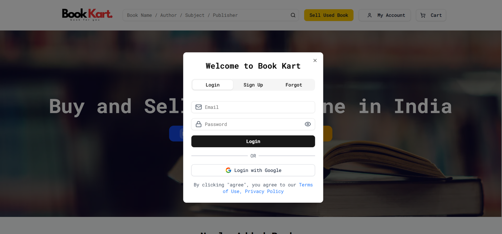
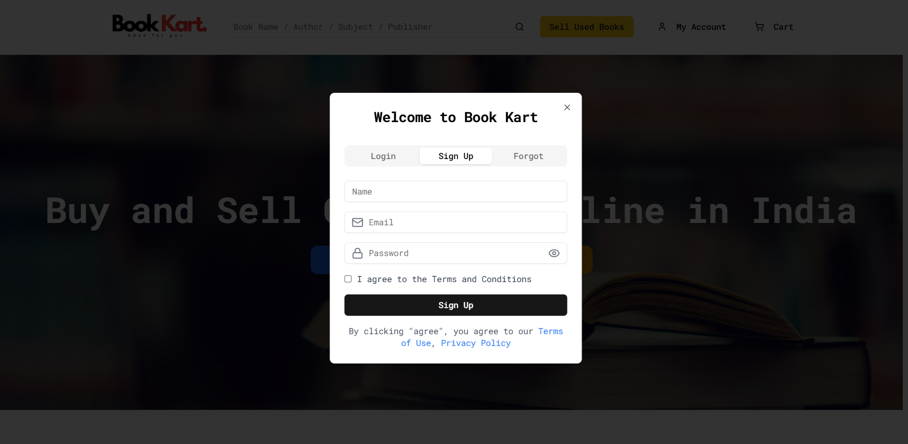
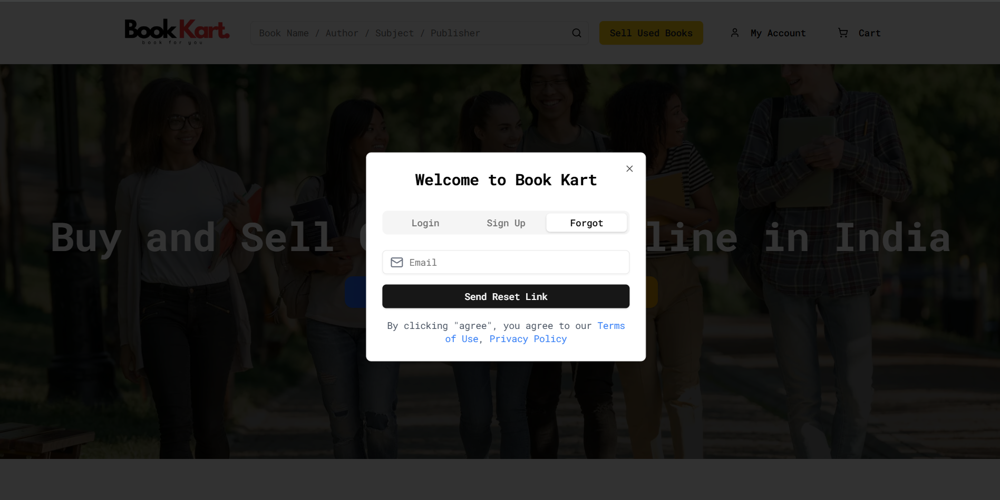

# 🚀 Book Kart E-commerce

A full-stack **bookstore application** that enables users to **browse, buy, and sell books** with secure **authentication**, **wishlist**, and **order management**.  
Built with **Next.js + React + TypeScript (Frontend)** and **Node.js + Express + MongoDB (Backend)**, featuring **Redux Toolkit** for state management, **Razorpay** payment integration, and **Gmail API** for email verification.

---

## 📚 Table of Contents

- [✨ Features](#-frontend-features)
  - [🎨 UI & Design](#-ui--design)
  - [📚 Book Browsing](#-book-browsing)
  - [🔄 State Management & Integration](#-state-management--integration)
- [🛠️ Backend Features](#-backend-features)
  - [🔐 Authentication & Security](#-authentication--security)
  - [🛒 Shopping & Checkout](#-shopping--checkout)
  - [📦 Orders & Delivery](#-orders--delivery)
  - [🗃️ Product & Book APIs](#-product--book-apis)
- [👤 User Features](#-user-features)
- [💳 Payment Integration](#-payment-integration)
- [📸 Screenshot Overview](#-screenshot-overview)
  - [🔐 HomePage](#-homepage)
  - [🏠 Login & Register & Forgot Password](#-login--register--forgot-password)
  - [⚙️ Account Information](#-account-information)
  - [⚙️ Order Receipt](#-order-receipt)
  - [📤 Sell Used Book Page](#-sell-used-book-page)
  - [🛠️ Product Page](#-product-page)
  - [🛒 Checkout Page](#checkout-page)
- [🏗️ Project Structure](#-project-structure)
  - [Frontend (React + Vite + Tailwind)](#client-frontend---react--vite--tailwind)
  - [Backend (Node + Express + MongoDB)](#server-backend---node--express--mongodb)
- [⚡ Tech Stack](#-tech-stack)
- [🚀 Getting Started](#-getting-started)
  - [📥 Clone Repository](#clone-repository)
- [⚙️ Environment Setup](#-environment-setup)
  - [Frontend `.env`](#client-env)
  - [Backend `.env`](#server-env)
- [🖥️ Client Setup](#-client-setup)
- [⚙️ Server Setup](#-server-setup)
- [💻 Know More About Tech Stack](#-know-more-about-tech-stack)


---

## ✨ Frontend Features

### 🎨 UI & Design

-   Fully responsive home screen for seamless experience across all devices
-   Clean and modern login page design
-   UI/UX improvements for smoother interaction and better visual flow

### 📚 Book Browsing

-   Display books with advanced filters and pagination
-   Single Book Page to view detailed book information
-   Wishlist functionality – save favorite books for later ❤️
-   Sell Books – let users list their old books 📚

### 🔄 State Management & Integration

-   Redux Toolkit with RTK Query for optimized state and data fetching
-   Full integration with backend APIs for real-time sync and interaction

---

## 🛠️ Backend Features

### 🔐 Authentication & Security

-   Secure user login with JWT tokens
-   Email verification using Gmail SMTP
-   Access control with proper authorization
-   Token management for authenticated sessions

### 🛒 Shopping & Checkout

-   Cart API for managing user shopping carts
-   Wishlist API to store user favorites
-   Razorpay Payment Gateway for secure transactions
-   Complete checkout flow for purchasing books

### 📦 Orders & Delivery

-   Order API with real-time status tracking
-   Order management panel for admins
-   Save and manage multiple shipping addresses

### 🗃️ Product & Book APIs

-   Product API with robust fetching, filtering, and pagination
-   Book sharing and social features to recommend to friends
-   Sell Books – enable users to list used books

---

## 👤 User Features

-   User profile page to update personal information
-   Order history and details with live status updates


## 💳 Payment Integration
- Razorpay integration for secure and seamless payments

---

## 📸 Screenshot Overview

### 🔐 HomePage

<p align="center">
  
  
</p>

---

### 🏠 Login & Register & Forgot Password

<p align="center">
  
  
  

</p>

---

### ⚙️ Account Information

<p align="center">
  
  
  
  
  

</p>

---

### ⚙️ Order Receipt

<p align="center">
  

</p>

---

### 📤 Sell Used Book Page

<p align="center">
  

</p>

### 🛠️ Product Page

<p align="center">
  
  
</p>

### Checkout Page
<p align="center">
  
  
  

  </p>

## 🏗️ Project Structure

### Client (Frontend - React + Vite + Tailwind)

```bash
---Frontend
    +---app
    |   |   favicon.ico
    |   |   globals.css
    |   |   layout.tsx
    |   |   LayoutWrapper.tsx
    |   |   not-found.tsx
    |   |   page.tsx
    |   |
    |   +---about-us
    |   |       page.tsx
    |   |
    |   +---account
    |   |   |   layout.tsx
    |   |   |
    |   |   +---orders
    |   |   |       orderDetailDialog.tsx
    |   |   |       page.tsx
    |   |   |
    |   |   +---profile
    |   |   |       page.tsx
    |   |   |
    |   |   +---selling-products
    |   |   |       page.tsx
    |   |   |
    |   |   \---wishlists
    |   |           page.tsx
    |   |
    |   +---book-sell
    |   |       page.tsx
    |   |
    |   +---books
    |   |   |   page.tsx
    |   |   |
    |   |   \---[id]
    |   |           page.tsx
    |   |
    |   +---checkout
    |   |   +---cart
    |   |   |       page.tsx
    |   |   |
    |   |   \---payment-success
    |   |           page.tsx
    |   |
    |   +---components
    |   |       AuthPage.tsx
    |   |       CartItems.tsx
    |   |       CheckoutAddress.tsx
    |   |       Footer.tsx
    |   |       Header.tsx
    |   |       NewBooks.tsx
    |   |       NoData.tsx
    |   |       PageLoader.tsx
    |   |       Pagination.tsx
    |   |       PriceDetails.tsx
    |   |       Share.tsx
    |   |       ShimmerEffect.tsx
    |   |
    |   +---privacy-policy
    |   |       page.tsx
    |   |
    |   +---reset-password
    |   |   \---[token]
    |   |           page.tsx
    |   |
    |   +---terms-of-use
    |   |       page.tsx
    |   |
    |   \---verify-email
    |       \---[token]
    |               page.tsx
    |
    +---components
    |   \---ui
    |           accordion.tsx
    |           avatar.tsx
    |           badge.tsx
    |           button.tsx
    |           card.tsx
    |           checkbox.tsx
    |           dialog.tsx
    |           dropdown-menu.tsx
    |           form.tsx
    |           input.tsx
    |           label.tsx
    |           radio-group.tsx
    |           scroll-area.tsx
    |           select.tsx
    |           separator.tsx
    |           sheet.tsx
    |           tabs.tsx
    |           textarea.tsx
    |
    +---lib
    |       type.ts
    |       utils.ts
    |
    +---public
    |   |   .DS_Store
    |   |   file.svg
    |   |   globe.svg
    |   |   next.svg
    |   |   vercel.svg
    |   |   window.svg
    |   |
    |   +---icons
    |   |       ads.png
    |   |       fast-delivery.png
    |   |       google.svg
    |   |       paytm.svg
    |   |       pay_online.png
    |   |       rupay.svg
    |   |       upi.svg
    |   |       visa.svg
    |   |
    |   \---images
    |           .DS_Store
    |           book1.jpg
    |           book2.jpg
    |           book3.jpg
    |           cart.jpg
    |           cart.webp
    |           login.jpg
    |           logo.png
    |           no-book.jpg
    |           web-logo.png
    |           wishlist.webp
    |
    +---store
    |   |   api.ts
    |   |   store.ts
    |   |
    |   +---Provider
    |   |       AuthProvider.tsx
    |   |
    |   \---slice
    |           cartSlice.ts
    |           checkoutSlice.ts
    |           userSlice.ts
    |           wishlistSlice.ts
    |
    \---utils
    |       contants.tsx
    |
    |   components.json
    |   eslint.config.mjs
    |   next-env.d.ts
    |   next.config.ts
    |   package-lock.json
    |   package.json
    |   postcss.config.mjs
    |   tailwind.config.ts
    |   tsconfig.json
```

### Server (Backend - Node + Express + MongoDB)

```bash
\---Backend
    |
    +---config
    |       cloudinaryConfig.ts
    |       dbConnect.ts
    |       emailConfig.ts
    |
    +---controllers
    |   |   addressController.ts
    |   |   authController.ts
    |   |   cartController.ts
    |   |   orderController.ts
    |   |   productController.ts
    |   |   userController.ts
    |   |   wishlistController.ts
    |   |
    |   \---strategy
    |           googleStragegy.ts
    |
    +---middleware
    |       authMiddleware.ts
    |
    +---models
    |       Address.ts
    |       CartItem.ts
    |       Order.ts
    |       Product.ts
    |       User.ts
    |       WishList.ts
    |
    +---routes
    |       addressRoutes.ts
    |       authRoutes.ts
    |       cartRoutes.ts
    |       orderRoutes.ts
    |       productRoutes.ts
    |       userRoutes.ts
    |       wishlistRoutes.ts
    |
    +---uploads
    |       042c47f7d31b46b2b101b9d392f8312f
    |       05c46a9b24869b7b51423c1c74586d8d
    |       067dec2b099f80a8525d0af80a4f205b
    |       
    |
    \---utils
    |       generateToken.ts
    |       responseHandler.ts
    |
    |   index.ts
    |   package-lock.json
    |   package.json
    |   tsconfig.json
```

---

## ⚡ Tech Stack

- **Frontend**: Next.js, TypeScript, React, TailwindCSS  
- **Backend**: Node.js, Express.js, Razorpay Integration, Multer, Cloudinary  
- **Database**: MongoDB  
- **Email Service**: Gmail SMTP  
- **State Management**: Redux Toolkit,RTK Query,Redux Persist  
- **External APIs**: Google Gmail API, Google OAuth2  
- **Authentication**: Bcrypt, OTP Verification, OAuth (Google)  


---

## 🚀 Getting Started

### Clone Repository

```bash
git clone https://github.com/AnkitShrestha911/bookkart-ecommerce.git
cd bookkart-ecommerce
```

## ⚙️ Environment Setup

### Client `.env`

```bash

# Backend & Frontend URLs
NEXT_PUBLIC_RAZORPAY_KEY=your_razorpay_key
NEXT_PUBLIC_API_URL=http://localhost:8000/api
```

### Server `.env`


```bash

PORT=8000
FRONTEND_URL=http://localhost:3000

# MongoDB
MONGODB_URI=your_mongodb_uri

#Gmail
EMAIL_USER=your_email
EMAIL_PASSWORD=your_email_key

#Jwt
JWT_SECRET=jwt_secret_key

#cloudinary
CLOUDINARY_NAME=your_cloudinary_name
CLOUDINARY_API_KEY=your_cloudinary_api_key
CLOUDINARY_API_SECRET=your_cloudinary_api_secret

# google credential
GOOGLE_CLIENT_ID=your_google_client_id
GOOGLE_CLIENT_SECRET=your_google_client_secret_key
GOOGLE_CALLBACK_URL=your_google_callback_url

# Razorpay 
RAZORPAY_ID=your_razorpay_key
RAZORPAY_SECRET=your_razorpay_secret

```

## 🖥️ Client Setup

1. Navigate to the **frontend** folder:
    ```bash
    cd frontend
    ```
2. Install dependencies:
    ```bash
    npm install
    ```
3. Add your environment variables in `.env`.
4. Run the development server:
    ```bash
    npm run dev
    ```

### ⚙️ Server Setup

1. Navigate to the **backend** folder:
    ```bash
    cd backend
    ```
2. Install dependencies:
    ```bash
    npm install
    ```
3. Add your environment variables in `.env`.

4. Create an account at [Cloudinary](https://cloudinary.com/)
  - Go to your **Dashboard** and get the following credentials:
  - **Cloud Name**
  - **API Key**
  - **API Secret**

5. Sign up at [Razorpay](https://razorpay.com/) 
   - Navigate to **Settings > API Keys**
   - Generate your **Key ID** and **Key Secret**

6. Run setup script (for database and required folders):
    ```bash
     npm run setup
    ```
7. Ensure Redis is running (via WSL or local setup).
8. Run the development server:
    ```bash
    npm run dev
    ```

---

## 💻 Know More About Tech Stack

### ✅ Frontend
- **Next.js** - Fast, SEO-friendly server-side rendering and routing
- **React.js** - Dynamic and component-based UI development
- **TypeScript** - Type-safe development for better maintainability
- **TailwindCSS** *(if used)* - Utility-first CSS framework for rapid styling

### ✅ Backend
- **Node.js** - JavaScript runtime for scalable backend development
- **Express.js** - Minimal and flexible Node.js web application framework
- **MongoDB** - NoSQL database for flexible, document-based storage
- **Multer** - Middleware for handling `multipart/form-data`, used for file uploads
- **Cloudinary** - Cloud storage and media management for images and files

### ✅ State Management
- **Redux Toolkit** - Simplified Redux logic for global state management
- **RTK Query** - Powerful data fetching and caching tool built into Redux Toolkit
- **Redux Persist** - helps persist Redux state across page reloads.

### ✅ Email Services
- **Gmail API** - Email verification and notifications

### ✅ Payments
- **Razorpay** - Secure and seamless payment gateway integration

---
